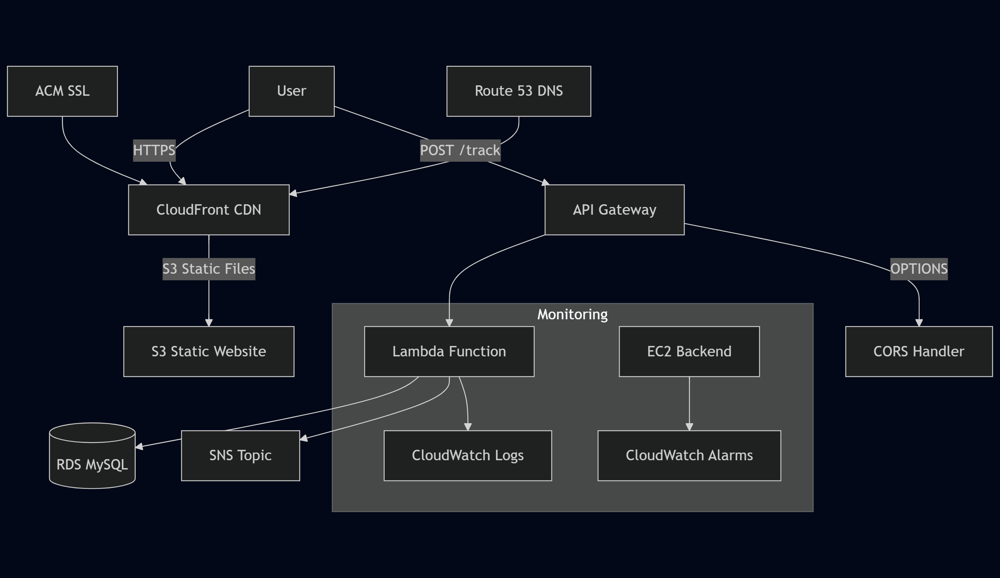

# Multi-Tier Web Application

📄 [🇵🇱 Zobacz wersję po polsku](README_PL.md)


This project is a portfolio application showcasing a multi-tier architecture on AWS:

- Backend: **Node.js** & **Express** on **EC2** *(migrated off in Sept 2025)*
- Database: **MySQL on RDS** *(removed in Sept 2025 for cost optimization)*
- Frontend: **Static website** on **S3 + CloudFront**
- Domain: **Route 53 + SSL via ACM**
- IaC: **CloudFormation**
- Monitoring: **CloudWatch + SNS**
- Custom domain: [https://crow-project.click](https://crow-project.click)

---

## 🚀 Features

- ✅ RESTful API (Express)
- ✅ MySQL on AWS RDS *(removed)*
- ✅ Static frontend on S3 with CloudFront
- ✅ SSL certificate (HTTPS)
- ✅ Visitor tracking with API Gateway + Lambda
- ✅ Dockerized backend
- ✅ CloudWatch alarms & dashboard
- 🛠️ Planned: CI/CD, ECS/EKS, Secrets Manager

---

## 💻 Deployment

As of **September 2025**, the application was optimized to reduce AWS costs:

- **Frontend** is deployed on **S3 + CloudFront** (with Route 53 + ACM for domain and SSL).
- **Backend & RDS** were decommissioned to minimize costs, while preserving functionality through AWS serverless services (Lambda + SNS/S3 planned for contact form).
- **CloudFront distribution** serves all static assets and enforces HTTPS.
- **Domain**: still accessible under 👉 [https://crow-project.click](https://crow-project.click).

---

## 💰 Cost Optimization

During September 2025, AWS costs increased due to **RDS** and **EC2** instances running outside the Free Tier.  
To minimize recurring costs:

- ❌ **Removed RDS (MySQL)** → replaced with lightweight serverless solutions (planned: S3/DynamoDB/SES).  
- ❌ **Stopped EC2 backend** → static frontend now runs on **S3 + CloudFront**.  
- ❌ **Removed WAF** → unnecessary for a portfolio project.  
- ❌ **Removed NAT Gateway** → replaced with **VPC Endpoints** where needed.  
- ✅ **Kept Route 53 + ACM** → domain and SSL certificate remain active.  

**Result:**  
Monthly costs dropped from ~27 USD → ~3 USD, while the application is still publicly available.

---

## 📊 Architecture Diagram *(coming soon)*



---

## 📦 Infrastructure as Code

Includes **CloudFormation** templates for:

- EC2 alarm + SNS: `cpu-alarm.yml`
- Frontend CDN: `cloudfront-distribution.yml`
- Demo S3 site: `demo-infra.yml`
- Visitor tracker (API Gateway + Lambda): `visit-tracker.yml`

---

## 📈 Monitoring & Observability

CloudWatch Dashboard includes:

- EC2 CPU usage *(legacy)*
- API response times (`MultiTierApp/ResponseTime`)
- Lambda `trackVisit` metrics:
  - Invocations
  - Errors
  - Duration
- API Gateway metrics:
  - 5XX Errors
  - Latency
  - Count
- SNS alerts for CPU spikes

---
## 🖥️ Run Locally

Clone the repository and install dependencies:

```bash
git clone https://github.com/cloudcr0w/multi-tier-web-app.git
cd multi-tier-web-app/frontend
npm install
npm start
```

## 🌐 Live Demo
Website: https://crow-project.click  
Currently hosting static frontend via **S3 + CloudFront**.  
*Contact form backend migration in progress (Lambda + S3 + SNS).*

---

## 🤖 AI Chatbot

Integrated **AI chatbot** on the frontend – deployed via **AWS Lambda + API Gateway** with **Bedrock Claude** model.  

- Responds to questions about my skills and projects  
- Dynamically styled chat window with animations  
- Input always visible & auto-scroll for messages  
- Security features: request normalization, blocklist, CORS, API Gateway throttling  

👉 Try it live: [https://crow-project.click](https://crow-project.click)  

---
## 📈 Monitoring & Observability

CloudWatch Dashboard includes:

- EC2 CPU usage *(legacy)*
- API response times (`MultiTierApp/ResponseTime`)
- Lambda `trackVisit` metrics

### Screenshots (coming soon)


## 📌 What's Next?
See FUTURE_PLANS.md for upcoming improvements:

- Auto Scaling, ALB
- GitHub Actions (CI/CD)
- ECS or EKS deployment
- WAF rule sets
- Secrets Manager or Parameter Store
- Serverless contact form (Lambda + S3 + SNS/SES)

---

## 🧠 Project Goals
Showcase AWS multi-tier design  
Demonstrate backend + infrastructure skills  
Emphasize real integrations with IaC, monitoring, and SSL  
Highlight cost optimization and real-world cloud governance

---

## 🍃 About the Author

**Adam Wrona** – aspiring DevOps Engineer passionate about building cloud-native solutions with **AWS**, **Terraform**, and real-world automation.  
Certified in AWS, fueled by coffee, and building hands-on projects to break into IT from scratch.

[](https://www.linkedin.com/in/adam-wrona-111ba728b/)  
🌍 [GitHub – @cloudcr0w](https://github.com/cloudcr0w)  
📫 adamwronowy@gmail.com

---

> ☁️ *"You can’t learn DevOps from videos — only from fixing what breaks at 2AM."*  
> — someone who ran `terraform apply` in prod
