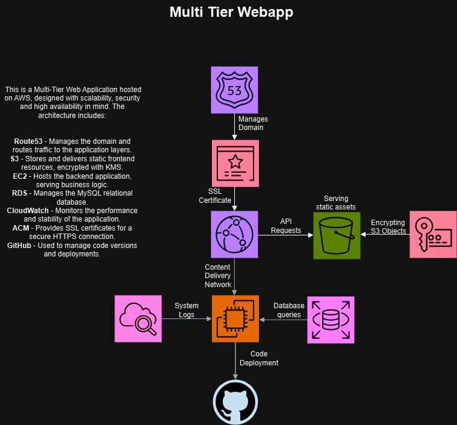

# Multi-Tier Web Application

This project is a portfolio application designed to showcase a multi-tier architecture on AWS. The backend is built with **Node.js** and **Express**, the database runs on **AWS RDS (MySQL)**, and the frontend is a static website hosted on **S3** and distributed through **CloudFront**. A custom domain is managed via **Route 53**, and SSL certificates are provided by **AWS Certificate Manager (ACM)**.

---

## Features

- **Backend**  
  RESTful API built with Node.js and Express.
  
- **Database**  
  MySQL database hosted on AWS RDS.

- **Frontend**  
  Static website hosted on AWS S3, served through CloudFront for global distribution.

- **Domain**  
  Custom domain integrated with Route 53 for DNS management.

- **CDN**  
  CloudFront used for fast and secure content delivery.

- **Security**  
  End-to-end encryption with SSL certificates from AWS ACM.

- :construction: **AWS WAF**, **AWS CloudFormation**, **GitHub Actions / AWS CodePipeline** (planned integrations)

---

## Architecture Diagram :construction: soon actual version :construction:



<sup>*(Update or replace `diagram.jpg` with your new diagram file, if needed.)*</sup>

### Frontend

- Hosted on **AWS S3** as a static website.
- Distributed globally using **CloudFront** for faster loading times.

### Backend

- RESTful API powered by **Express.js**.
- Hosted on an **AWS EC2** instance.
- Communicates with **AWS RDS** for data storage.

### Database

- **MySQL** database on **AWS RDS**.
- Configured for secure and reliable data management.

### Security

- All traffic encrypted using **SSL certificates** (AWS ACM).
- API endpoint served over **HTTPS** for secure communication.
- (Planned) Additional AWS WAF rule sets for advanced threat protection.

---

## CloudWatch CPU Alarm and SNS Notifications

This repository includes a CloudFormation template (`infrastructure/cloudformation/cpu-alarm.yml`) to create a CloudWatch Alarm for monitoring EC2 CPU utilization and an SNS Topic for notifications.

### How to Deploy

To deploy the stack, run the following command (replace parameters with your values):

```bash
aws cloudformation create-stack \
  --stack-name cpu-alarm-stack \
  --template-body file://infrastructure/cloudformation/cpu-alarm.yml \
  --parameters ParameterKey=InstanceId,ParameterValue=i-0cfc689bb03f5f9ac \
               ParameterKey=AlarmThreshold,ParameterValue=80 \
               ParameterKey=EvaluationPeriods,ParameterValue=1 \
               ParameterKey=SNSSubscriptionEmail,ParameterValue=adamwronowy@gmail.com \
  --capabilities CAPABILITY_NAMED_IAM
  ```

### CloudFront Distribution
The cloudfront-distribution.yml template creates a CloudFront distribution for our static website hosted in the S3 bucket crowproject-bucket. It sets the origin path to /frontend and defines the default root object as index.html.

To deploy, run:

```bash

aws cloudformation create-stack \
  --stack-name cloudfront-stack \
  --template-body file://infrastructure/cloudformation/cloudfront-distribution.yml \
  --capabilities CAPABILITY_NAMED_IAM
  ```
### Docker Containerization
This project includes a Dockerfile for containerizing the backend application.

How to Build and Run Locally
Build the Docker image:

```bash
docker build -t my-backend-app .
docker run -p 3000:3000 my-backend-app
```
Your application should now be accessible at http://localhost:3000

### CloudFormation Demo
As part of demonstrating Infrastructure as Code (IaC), this repository includes a simple CloudFormation template:

Location: infrastructure/cloudformation/demo-infra.yml
Purpose: Creates a demo S3 bucket for hosting static content.
How to Deploy
Make sure you have the AWS CLI installed and configured.
Run the following command from the project's root directory:
```bash

aws cloudformation create-stack \
  --stack-name demo-infra-stack \
  --template-body file://infrastructure/cloudformation/demo-infra.yml \
  --capabilities CAPABILITY_NAMED_IAM
  ```

Wait for the stack to reach the CREATE_COMPLETE status (check in AWS Console or via CLI).
You can then verify that the bucket is created in your AWS S3 console.
If you want to remove the bucket afterward, delete the stack:

```bash
Kopiuj
aws cloudformation delete-stack --stack-name demo-infra-stack
```
## Services Used ##
## AWS EC2 ## – Hosting the backend application
## AWS S3 ##– Storing and serving static assets for the frontend
## AWS CloudFront ## – Content Delivery Network for fast, global access
## AWS Route 53 ## – Domain registration and DNS management
## AWS RDS (MySQL) ## – Managed relational database service
## AWS ACM ## – SSL certificate for secure HTTPS connections
## :construction: AWS CloudWatch ## – Monitoring and high availability (planned)
## :construction: AWS KMS ## – Encryption for data at rest (planned)
## :construction: AWS SNS ## – Notifications for CPU alarms or form submissions (planned)
## GitHub ## – Version control and collaboration

### Usage
Visit the Website
The application is live at https://crow-project.click.

Try the Contact Form
Submit a message through the form, which will be securely stored in the MySQL database.

Explore the Code
Browse this repository for a deeper look into the Node.js/Express backend, database setup, and infrastructure components.

Project Goals
Demonstrate a Multi-Tier Architecture
Show how various AWS services integrate to create a secure and scalable web application.

Highlight Cloud & Backend Skills
Emphasize experience in Node.js, AWS services, and cloud-based deployments.

End-to-End Integration
Illustrate how a custom domain, SSL, CDN, and database come together for a production-ready setup.

Future Improvements
Auto Scaling & ALB: Add an Application Load Balancer and Auto Scaling Group for the backend.
CI/CD Pipeline: Implement GitHub Actions or AWS CodePipeline for automated builds and deployments.
Secrets Management: Store credentials in AWS Secrets Manager or Parameter Store.
Extended WAF Rules: Integrate AWS Managed Rule Groups for advanced threat protection.
ECS / EKS: Deploy containers in AWS Fargate or Kubernetes for highly scalable environments.
This project demonstrates my ability to design, build, and deploy cloud-based applications. It serves as a comprehensive showcase of my skills in cloud computing, backend development, and AWS services.